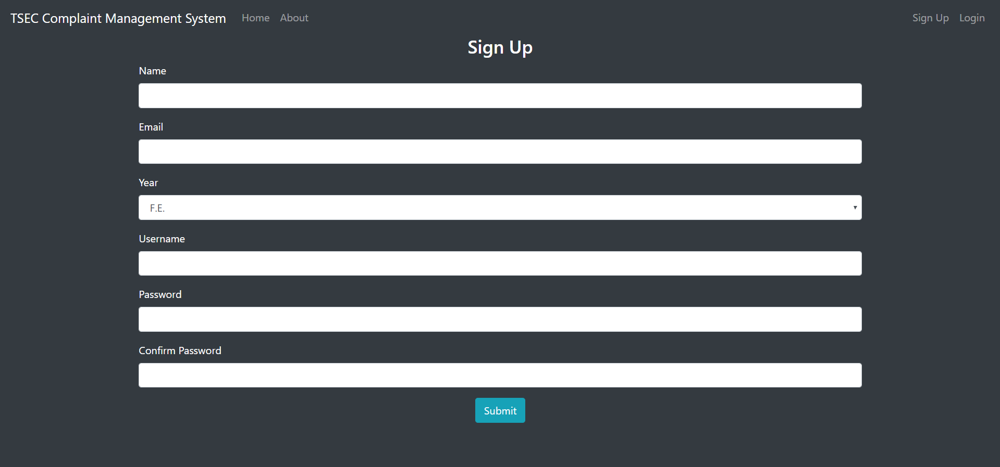
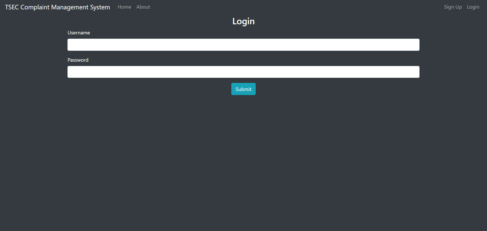
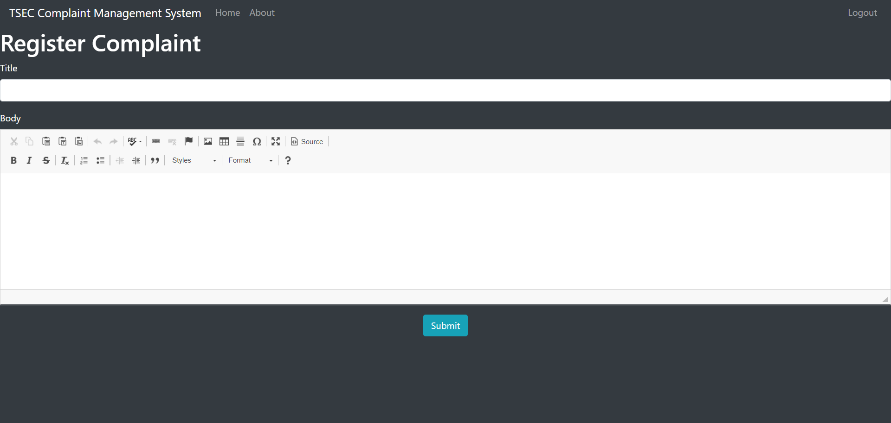
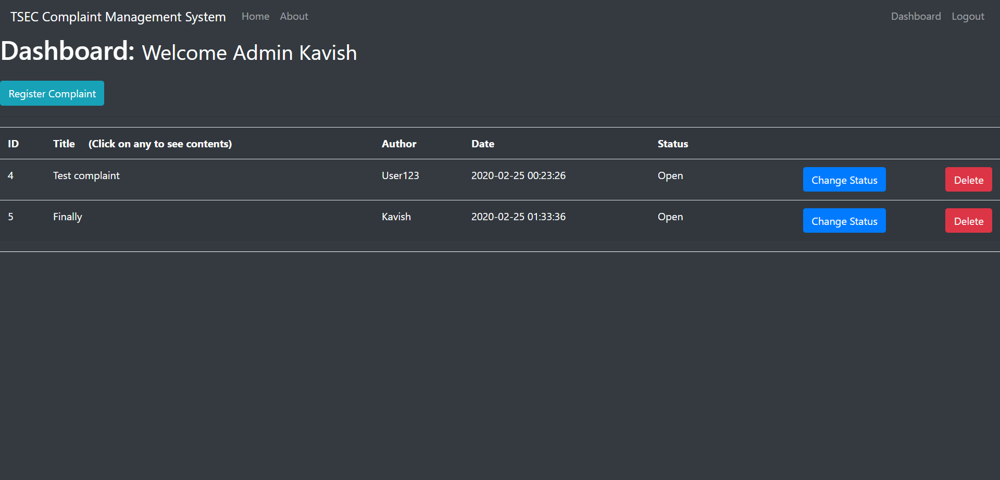

# A Complaint Management System App

> The app allows you register and log complaints. 

## Requirements
```
A version of python
pip package manager installed
Local instance of MySQL running on localhost as user root
Set MySQL password as an environment variable as 'MYSQL_PWD'
Run queries.sql
```
```bash
pip install flask
pip install mysqlclient
pip install flask-mysqldb
pip install flask-WTF
pip install passlib
```

## Quick Start

```bash
# Clone the repository
git clone https://github.com/KavishShah09/Issue-Logger.git
```

> ### Create a file called config.py that looks like
```python
import os

DEBUG = True
TESTING = True
MYSQL_HOST = 'localhost'
MYSQL_USER = 'root'
MYSQL_PASSWORD = os.getenv('MYSQL_PWD')
MYSQL_DB = 'cms'
MYSQL_CURSORCLASS = 'DictCursor'
SECRET_KEY = 'your_secret_key'
```

## Go to the directory where you cloned the repository

> Run 
```bash
python app.y
```

Runs the app in the development mode.<br />
Open [http://localhost:5000](http://localhost:5000) to view it in the browser.

<p align="center">
 
 <br>
 
</p>

# Two types of users:

## 1) User (default):
Will be allowed only to submit complaints to the server via a form
<p align="center">
 
</p>

## 2) Admin:
Can view all complaints on a dashboard and can change the status or delete the complaint

<p align="center">
 
</p>

To become an admin you must first sign up as a user and then in your local instance of MySQL run the following query:

```SQL
UPDATE users SET role = 'admin' WHERE username = 'your_sign_up_username';
```


## App Info

### Author [Kavish Shah](http://www.linkedin.com/in/kavish-shah-501b32192)

### Version 1.0.0
